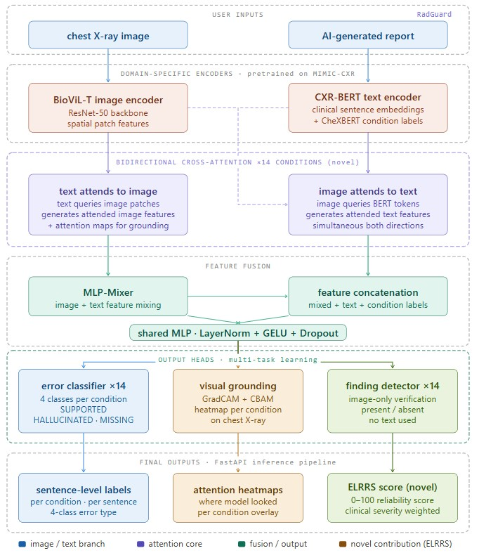

# RadGuard — AI Radiology Report Error Detection

> Automatically detect errors in AI-generated chest X-ray reports using multimodal deep learning.

**🤗 Live Demo:** [radguard-demo on HF Spaces](https://huggingface.co/spaces/alyrraza/radguard-demo) &nbsp;·&nbsp; **⚡ API:** [radguard-api on HF Spaces](https://huggingface.co/spaces/alyrraza/radguard-api) &nbsp;·&nbsp; **🧠 Model Weights:** [alyrraza/radguard-v11](https://huggingface.co/alyrraza/radguard-v11)

---

## Problem Statement

AI-generated radiology reports are increasingly used in clinical workflows, but they make systematic errors that radiologists must manually catch before the reports reach patients. These errors fall into four categories:

| Error Class            | Meaning                                          | Clinical Risk             |
| ---------------------- | ------------------------------------------------ | ------------------------- |
| **SUPPORTED**    | AI finding matches the image                     | ✅ Correct                |
| **HALLUCINATED** | AI reported a finding not present in the image   | 🔴 High — false positive |
| **MISSING**      | AI missed a finding that is present in the image | 🔴 High — false negative |
| **INACCURATE**   | AI found something but described it incorrectly  | 🟡 Medium — misleading   |

Manual review of every AI report is expensive and slow. **RadGuard** automates this screening — flagging errors per condition across 14 chest pathologies — so radiologists can focus attention on the cases that matter.

---

## Solution

A multimodal deep learning model that takes:

- A **chest X-ray image**
- An **AI-generated report sentence**

And produces per-condition error classifications across 14 chest conditions, with visual attention maps showing *where* in the image the model is looking for each condition.

---

## Architecture



```
┌─────────────────────────────────────────────────────────────────┐
│                    RadGuard V11 Architecture                     │
│                                                                  │
│  Chest X-Ray (448×448)          AI Report Text                  │
│         │                              │                         │
│  ┌──────▼──────┐                ┌──────▼──────┐                │
│  │  BioViL-T   │                │  CXR-BERT   │                │
│  │ Image Enc.  │                │  Text Enc.  │                │
│  │ (MIMIC-CXR) │                │ (MIMIC-CXR) │                │
│  └──────┬──────┘                └──────┬──────┘                │
│         │ [B, 512, 14, 14]             │ [B, 768]              │
│         │ 196 spatial regions          │ CLS token             │
│         └──────────────┬───────────────┘                        │
│                        │                                         │
│          ┌─────────────▼──────────────┐                         │
│          │  Bidirectional Cross-Attn  │                         │
│          │  (14 condition-specific    │                         │
│          │   attention heads)         │                         │
│          │                            │                         │
│          │  Dir 1: Text → Image       │ ← WHERE in image       │
│          │  Dir 2: Image → Text       │ ← WHAT in report       │
│          └─────────────┬──────────────┘                         │
│                        │                                         │
│          ┌─────────────▼──────────────┐                         │
│          │      MLP-Mixer Fusion      │                         │
│          │  + Match Type Embedding    │                         │
│          │  + AI CheXbert Labels      │                         │
│          └─────────────┬──────────────┘                         │
│                        │                                         │
│               ┌────────▼────────┐                               │
│               │  Per-Condition  │                               │
│               │  Classification │                               │
│               │  (14 × 4 heads) │                               │
│               └────────┬────────┘                               │
│                        │                                         │
│    ┌───────────────────▼─────────────────────┐                 │
│    │  14 Conditions × {SUPPORTED, HALLUCINATED│                 │
│    │                   MISSING,  INACCURATE}  │                 │
│    └─────────────────────────────────────────┘                 │
└─────────────────────────────────────────────────────────────────┘
```

### Key Design Decisions

**Why BioViL-T + CXR-BERT?**
Both encoders are jointly pretrained on MIMIC-CXR — the same dataset as our task. Their feature spaces are already aligned, making bidirectional cross-attention semantically meaningful. Earlier versions using DenseNet (ImageNet) + ClinicalBERT had mismatched feature spaces, creating a ceiling on performance.

**Why Bidirectional Cross-Attention?**

- *Text → Image*: each condition's text query attends to 196 spatial image regions, learning WHERE the condition is located
- *Image → Text*: image features attend to report tokens, learning WHAT the AI said about each region
- Together they build a joint image-text understanding needed to detect INACCURATE errors specifically

**Why 14 Separate Attention Heads?**
Each chest condition (Cardiomegaly, Pneumothorax, Pleural Effusion, etc.) has a distinct anatomical location. Shared attention would average these away. Condition-specific heads let Pneumothorax look at the apex while Cardiomegaly looks at the center.

---

## Training Versions

All versions trained on MIMIC-CXR dataset. Evaluation metric: **macro F1** averaged across all 14 conditions.

| Version       | Val F1           | Key Change                                                                   | Notes                            |
| ------------- | ---------------- | ---------------------------------------------------------------------------- | -------------------------------- |
| **V1**  | 0.5468           | DenseNet-121 + ClinicalBERT baseline                                         | MLP-Mixer fusion, no attention   |
| **V2**  | 0.5619           | Condition-specific cross-attention + anatomy/entropy losses                  | Best DenseNet baseline           |
| **V3**  | 0.5574           | Higher anatomy/entropy loss weights                                          | Overfit to anatomy priors        |
| **V4**  | 0.5397           | Entropy loss only, no anatomy                                                | Attention collapse               |
| **V5**  | 0.5518           | BioViL-T encoders (MIMIC-CXR pretrained)                                     | Image resolution bug (upsampled) |
| **V6**  | 0.5625           | Original-res images + bidirectional attn + match type embed + INACCURATE aux | Fixed resolution bug             |
| **V7**  | 0.5615           | Pseudo grounding loss (λ=0.15), anatomy λ=0.4                              | Pseudo masks via BioViL          |
| **V8**  | 0.5643           | Fixed condition-specific pseudo queries, anatomy λ=0.3                      | Bug fix in V7 pseudo loss        |
| **V11** | **0.6600** | Stratified split + ReduceLROnPlateau + 74k clean MIMIC dataset               | **Best model**             |

### V11 Breakthrough

V11 identified and fixed three data/training issues that were suppressing performance in all previous versions:

1. **FIX 1 — Stratified Split**: Previous train/val splits were random by row, causing data leakage across studies. V11 splits by patient study ID with stratification on error distribution.
2. **FIX 2 — Balanced LR**: BioViL encoder LR (2e-6) and task head LR (1e-4) properly decoupled with separate optimizer param groups.
3. **FIX 3 — ReduceLROnPlateau**: Replaces fixed cosine schedule with adaptive LR reduction (factor=0.5, patience=3) — LR drops when val F1 plateaus.

---

## 14 Chest Conditions

```
Enlarged_Cardiomediastinum  │  Cardiomegaly       │  Lung_Opacity
Lung_Lesion                 │  Edema              │  Consolidation
Pneumonia                   │  Atelectasis        │  Pneumothorax
Pleural_Effusion            │  Pleural_Other      │  Fracture
Support_Devices             │  No_Finding
```

---

## Tech Stack

| Layer                      | Technology                                           |
| -------------------------- | ---------------------------------------------------- |
| **Image Encoder**    | BioViL-T (Microsoft Research, MIMIC-CXR pretrained)  |
| **Text Encoder**     | CXR-BERT (Microsoft Research, MIMIC-CXR pretrained)  |
| **Framework**        | PyTorch 2.x + AMP (automatic mixed precision)        |
| **Backend API**      | FastAPI + Uvicorn                                    |
| **Frontend**         | React 18 + Vite                                      |
| **Containerization** | Docker + Docker Compose                              |
| **Model Registry**   | MLflow (SQLite backend)                              |
| **Dataset**          | MIMIC-CXR (74,060 stratified samples, 14 conditions) |
| **Training GPU**     | NVIDIA RTX 5090 (33.7 GB VRAM) via Vast.ai           |
| **Model Hosting**    | HuggingFace Hub (alyrraza/radguard-v11)              |
| **API Deployment**   | HuggingFace Spaces — Docker SDK (2 vCPU, 16GB RAM)  |

---

## Project Structure

```
RadGuard-Medical-AI/
├── README.md
├── docker-compose.yml
├── frontend-test.html   ← standalone test page for the HF API
│
├── ai-engine/           ← FastAPI ML service (deployed on HF Spaces)
│   ├── Dockerfile
│   ├── requirements.txt
│   ├── main.py          ← /analyze endpoint
│   └── inference/
│       ├── model.py         ← V11 architecture + HF Hub auto-download
│       ├── pipeline.py      ← ELRRs scoring, sentence aggregation
│       └── chexbert_runner.py ← Stanford CheXbert label extractor
│
├── backend/             ← partner service (FastAPI + MongoDB)
│   └── Dockerfile
│
└── frontend/            ← React 18 + Vite
    ├── Dockerfile
    ├── nginx.conf
    ├── package.json
    ├── vite.config.js
    └── src/
        ├── main.jsx
        ├── App.jsx
        ├── index.css
        └── components/
```

---

## Quick Start

### With Docker (recommended)

```bash
git clone https://github.com/alyrraza/RadGuard-Medical-AI
cd RadGuard-Medical-AI

# set your HuggingFace token in .env (for private model repo)
echo "HF_TOKEN=hf_xxxx" > .env

docker-compose up --build
```

- Frontend: http://localhost:3000
- AI Engine API: http://localhost:7860/docs
- Backend API: http://localhost:8000

## Demo

### Live Inference


### Full Demo Video
<video src="docs/bandicam%202026-04-28%2001-12-47-957.mp4" controls width="100%"></video>
### Without Docker

**Backend:**

```bash
cd backend
pip install -r requirements.txt
uvicorn main:app --reload --port 8000
```

**Frontend:**

```bash
cd frontend
npm install
npm run dev
```

---

## API Reference

**Live endpoint:** `https://alyrraza-radguard-api.hf.space`

### `POST /analyze`

Analyze a chest X-ray image against an AI-generated report.

**Request** (multipart/form-data):

| Field        | Type   | Description                          |
| ------------ | ------ | ------------------------------------ |
| `file`       | file   | Chest X-ray (JPEG/PNG)               |
| `ai_report`  | string | AI-generated radiology report text   |

**Example:**

```bash
curl -X POST https://alyrraza-radguard-api.hf.space/analyze \
  -F "file=@chest_xray.jpg" \
  -F "ai_report=There is a small right apical pneumothorax. The cardiac silhouette is normal."
```

**Response:**

```json
{
  "task1_elrrs": {
    "score": 65.0,
    "grade": "Fair",
    "supported_count": 2,
    "hallucinated_count": 1,
    "missing_count": 0,
    "inaccurate_count": 1
  },
  "task1_conditions": [
    {
      "name": "Pneumothorax",
      "verdict": "SUPPORTED",
      "confidence": 0.91,
      "xray_present": true,
      "source_text": "There is a small right apical pneumothorax."
    }
  ],
  "task2_xray_findings": {
    "Pneumothorax": { "xray_present": true, "confidence": 0.91 }
  },
  "task3_heatmaps": {
    "Pneumothorax": "https://alyrraza-radguard-api.hf.space/results/abc123_Pneumothorax.png"
  },
  "not_mentioned": ["Edema", "Consolidation"],
  "sentences_analyzed": 2,
  "request_id": "abc123ef"
}
```

### ELRRs Score Grades

| Score | Grade | Meaning |
|---|---|---|
| 80–100 | Excellent | Clinically safe |
| 60–79  | Good      | Minor errors |
| 40–59  | Fair      | Review advised |
| 20–39  | Poor      | High risk |
| 0–19   | Critical  | Unsafe |

---

## Dataset

- **Source**: MIMIC-CXR (PhysioNet, requires credentialed access)
- **HuggingFace mirror**: `itsanmolgupta/mimic-cxr-dataset`
- **Size**: 74,060 rows (V11 clean stratified split)
- **Images**: 30,633 unique chest X-ray studies
- **Labels**: 262,020 condition-level error annotations

---

## Citation

If you use RadGuard in research, please cite:

```bibtex
@misc{radguard2025,
  title  = {RadGuard: Multimodal Error Detection in AI-Generated Chest X-Ray Reports},
  author = {[Ali Raza]},
  year   = {2026},
  note   = {Final Year Project, NUCES}
}
```

---

## License

MIT License — see [LICENSE](LICENSE) for details.

> **Medical Disclaimer**: RadGuard is a research prototype. It is not FDA-approved and must not be used for clinical diagnosis. Always consult a qualified radiologist.
